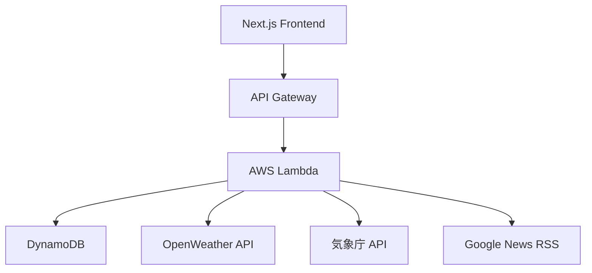
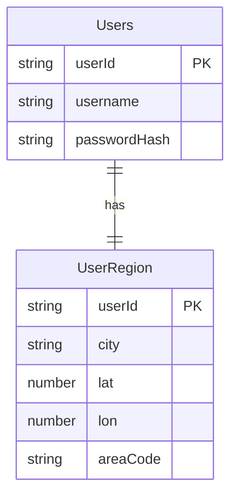
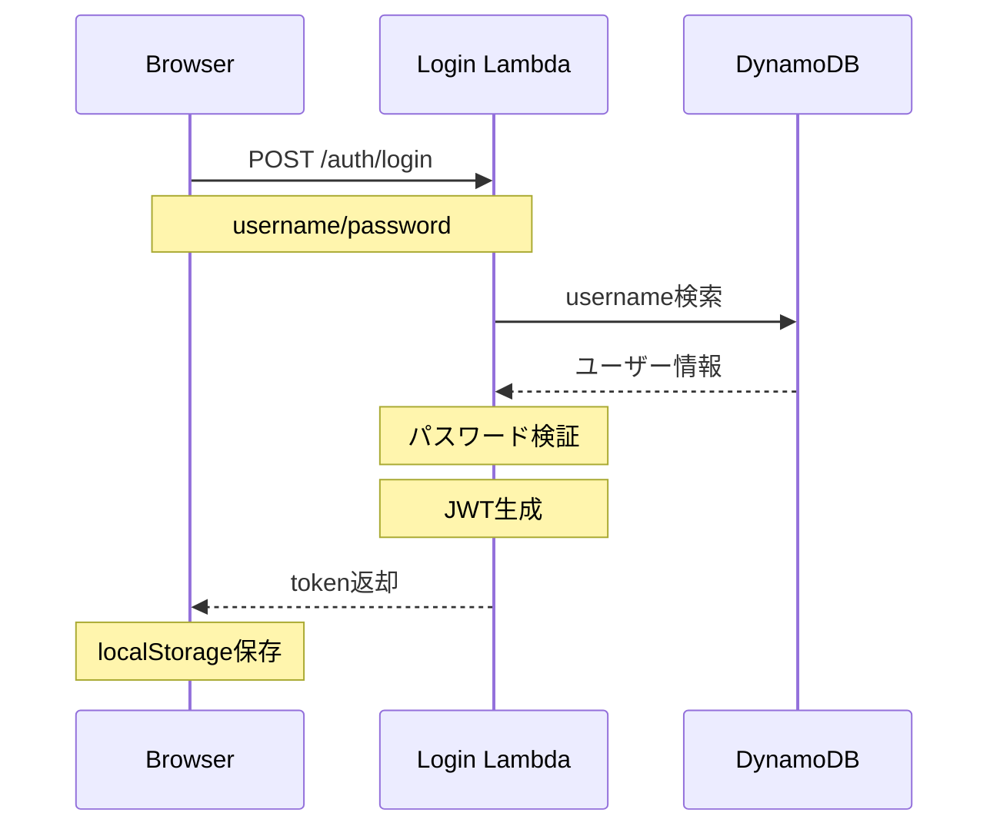
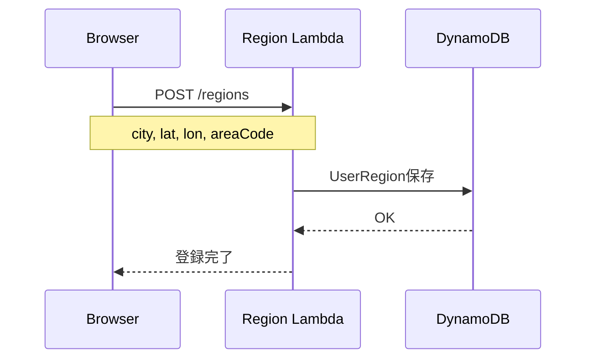
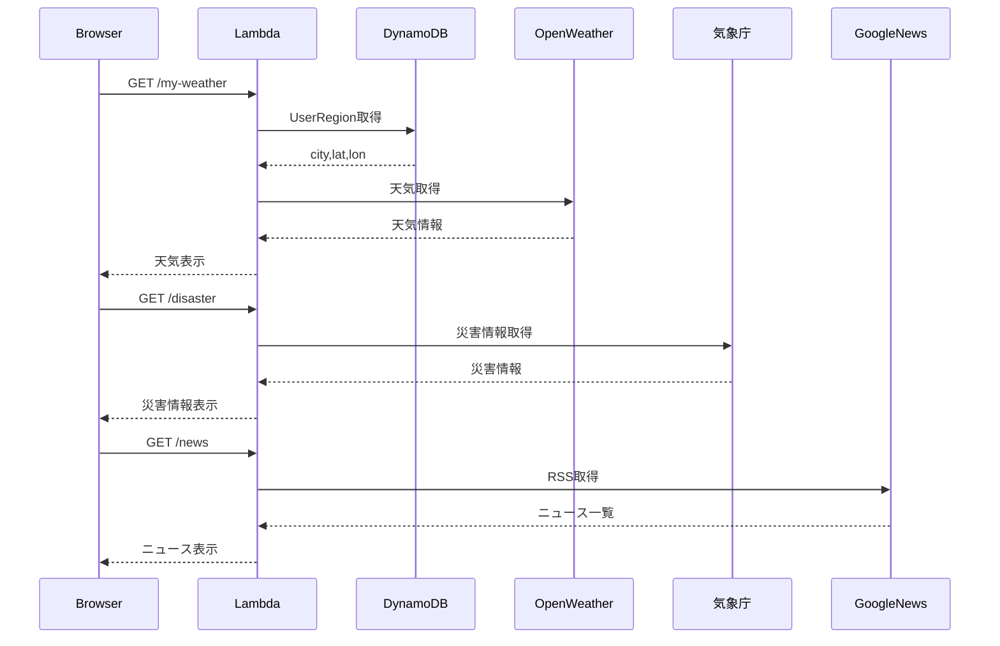

# 地域情報アプリ

## 概要
地域を設定することで、その地域の情報を取得できるWebアプリです。

- ユーザー登録
- JWT認証ログイン
- 地域設定
- 天気情報取得（OpenWeather）
- 災害情報取得（気象庁）
- 地域ニュース取得（Google News RSS）

## 使用技術

### Frontend
- Next.js
- React
- TypeScript
- Tailwind CSS

### Backend
- AWS Lambda
- API Gateway
- DynamoDB
- Serverless Framework

### External API
- OpenWeather API
- 気象庁防災情報API
- Google News RSS

## 環境構築

### 準備

以下を事前に用意してください。
### AWS

1. AWSアカウント作成
2. IAMユーザー作成
3. AWS CLIインストール
4. AWS CLI設定

```bash
aws configure
```

## そのほか

- OpenWeather API Key
- Node.js 20以上
- Serverless Framework

```bash
npm install -g serverless
```

### セットアップ
* git clone <repository>
* cd regional-info-form

### バックエンド
1. cd backend <br>
   cp .env.example .env
   * JWT_SECRETとWEATHER_KEYを設定
2. DynamoDB tables作成(awsコンソール)

- Users
   - Partition Key
      - userId (String)
   - Global Secondary Index
      - index名: username-index
      - partition key: username (String)
- UserRegion
  -  Partition Key
     - userId (String)

3. npm install
4. serverless deploy

### フロントエンド
1. npm install
2. touch .env.local
   * AWS API Gateway のステージURLを設定
   * 設定：NEXT_PUBLIC_API_BASE=https://xxxxx.execute-api.ap-northeast-1.amazonaws.com/dev
3. npm run dev

## URL
* http://localhost:3000

## システム構成図



## ER図



## ログイン シーケンス図



## 地域登録 シーケンス図



## 地域情報取得 シーケンス図



## API仕様

| Method | Path           | 説明            |認証               |
| ------ | -------------- | -------------- | ------------------ |
| POST   | /auth/register | ユーザー登録    | 不要                |
| POST   | /auth/login    | ログイン        | 不要                |
| POST   | /regions       | 地域登録        | 必要 (Bearer Token) |
| GET    | /regions/me    | 地域情報取得    | 必要 (Bearer Token) |
| GET    | /my-weather    | 天気情報取得    | 必要 (Bearer Token) |
| GET    | /disaster      | 災害情報取得    | 必要 (Bearer Token) |
| GET    | /news          | 地域ニュース取得 | 必要 (Bearer Token) |

### API利用手順

1. `POST /auth/register` でユーザー登録
2. `POST /auth/login` でJWTを取得
3. 認証が必要なAPIでは以下のヘッダーを付与

```http
Authorization: Bearer <JWT_TOKEN>
```


### POST /auth/register

**Request Body**

```json
{
  "username": "test",
  "password": "12345678"
}
```

**Response(201 Created)**

```json
{
  "message": "user created",
  "userId": "f92fabc4-89c4-4b6b-bddd-f4d671d71c1f"
}
```

### POST /auth/login

**Request Body**

```json
{
  "username": "test",
  "password": "12345678"
}
```

**Response(200 OK)**

```json
{
  "token": "...",
  "userId": "f92fabc4-89c4-4b6b-bddd-f4d671d71c1f",
  "username": "test"
}
```

### POST /regions

**Authorization**

```http
Authorization: Bearer <JWT_TOKEN>
```

**Request Body**

```json
{
    "city": "大府市",
    "lat": 35.015,
    "lon": 136.963,
    "areaCode": "230000"
}
```

**Response(200 OK)**

```json
{
    "message": "saved"
}
```

### GET /regions/me

**Authorization**

```http
Authorization: Bearer <JWT_TOKEN>
```

**Response(200 OK)**

```json
{
    "lon": 136.963,
    "city": "大府市",
    "lat": 35.015,
    "areaCode": "23223",
    "userId": "f92fabc4-89c4-4b6b-bddd-f4d671d71c1f"
}
```

### GET /my-weather

**Authorization**

```http
Authorization: Bearer <JWT_TOKEN>
```

**Response(200 OK)**

```json
{
    "city": "大府市",
    "weather": "Rain",
    "description": "強い雨",
    "temp": 23.28,
    "humidity": 92
}
```

### GET /disaster

**Authorization**

```http
Authorization: Bearer <JWT_TOKEN>
```

**Response(200 OK)**

```json
{
    "city": "大府市",
    "headline": "愛知県では、２８日夜遅くまで濃霧による視程障害に注意してください。"
}
```

### GET /news

**Authorization**

```http
Authorization: Bearer <JWT_TOKEN>
```

**Response(200 OK)**

```json
{
    "city": "大府市",
    "news": [
        {
            "title": "...",
            "link": "...",
            "date": "...",
            "score": 10
        }
    ]
}
```